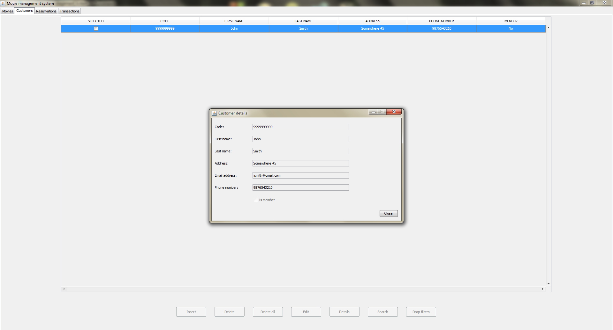

# Movie-Management-System

This is a simple movie management system made in Java. The system's features include:

### Movies

- Create / Edit / Delete / View / Search movies from your database.
- Update movie stock based on reservations.

### Customers

- Create / Edit / Delete / View / Search customers from your database.
- Create reservations for these customers.

### Reservations

- Create / View / Complete / Cancel / Search reservations from your database.
- Create a transaction if a reservation is completed (Once a reservation is completed or canceled, it cannot be undone).
- Show reservation status depending on current date.

### Transactions

- View / Search all transactions in your database.

### System requirements

In order to run the above application you need to have:

- Java JDK 1.8 or above.
- MySQL 5.7 or above installed and running.

## System screenshots

### Movies

### Customers

### Reservations

### Transactions

